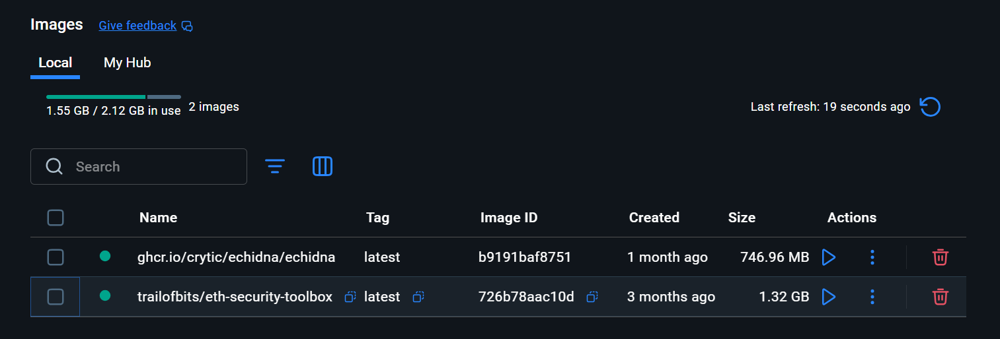
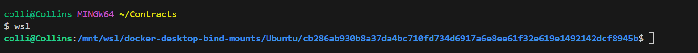

[![Ask Me Anything][0a]][0b]
![Open Source Love][0c]

[0a]: https://img.shields.io/badge/Ask%20me-anything-1abc9c.svg
[0b]: https://github.com/open-AIMS/docker-example/issues/new
[0c]: https://badges.frapsoft.com/os/v2/open-source.svg?v=103


**Warning:** This task was done with --Windows wsl which provided (Unix-based enviroment) and Docker Desktop as shown below; please [raise an issue][0b] and I'll try to expand this tutorial in future as soon as possible.

# Overview 

**Major steps.**

1) First of all, you need to download and [install Docker Desktop] on your machine. This is basically the software that contains all the tricks for you to run your own containers. Once you finished installing it, open the software which will contain OS-specific examples on how to build Docker images.
   
 

2) Clone the Echidna property-based fuzzing tool https://github.com/crytic/echidna so that we use it for our task.

3) Since we are using windows we need to install Windows Subsystem for Linux (WSL) which will grant us Linux distribution (such as Ubuntu, OpenSUSE, Kali, Debian, Arch Linux, etc) and use Linux applications, utilities, and Bash command-line tools directly on Windows, unmodified, without the overhead of a traditional virtual machine or dualboot setup

 
 
 
 
4) Command for running Taxpayer.sol
  ```
  docker run -it --rm \
  -v $PWD:/code \
  -v /usr/local/bin/solc:/usr/bin/solc \
  ghcr.io/crytic/echidna/echidna \
  echidna /code/Taxpayer.sol --contract Taxpayer
  ```

5) Command for running Lottery.sol
  ```
   docker run -it --rm \
  -v $PWD:/code \
  -v /usr/local/bin/solc:/usr/bin/solc \
  ghcr.io/crytic/echidna/echidna \
  echidna /code/Lottery.sol --contract Lottery
  ```


